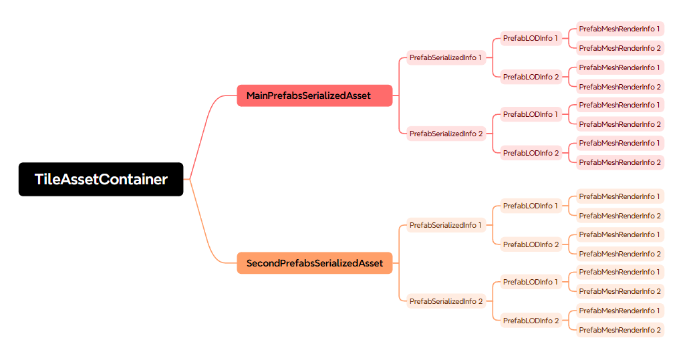
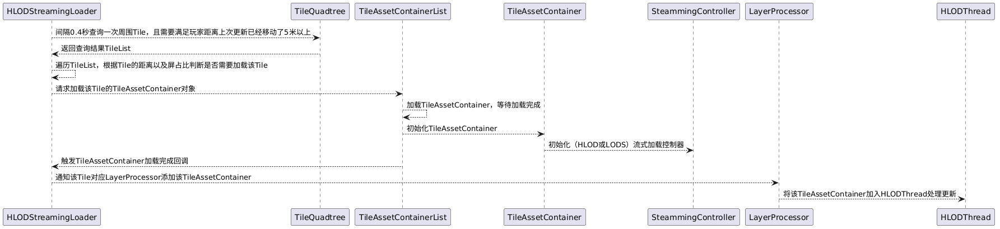
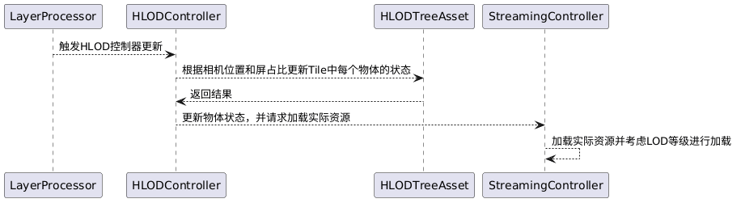
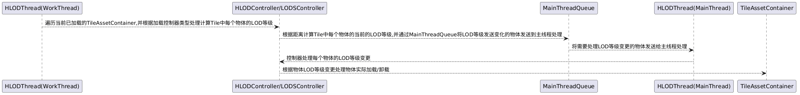

# HLOD（Hierarchical Level of Detail）层级LOD

## 资源管理
将场景按1k的大小划分成地块，称为Tile。一个Tile中的所有信息用TileAssetContainer结构记录

**PrefabsSerializedAsset(Main):** 记录hlod低模资源数据，包含Tile中所有tag、光照贴图、prefab数据、资源路径和hash
**PrefabsSerializedAsset(Sencond):** 记录hlod高模资源数据，包含Tile中所有tag、光照贴图、prefab数据、资源路径和hash

**PrefabSerializedInfo:** 记录单个perfab数据，包含预制体类型（地形、树、石头、水体）、子LOD prefab数据

**PrefabLODInfo:** 记录单个子LOD Prefab数据

**PrefabMeshRenderInfo:** 记录子LOD Prefab上单个MeshRenderer数据，包含网格资源路径，材质资源路径，Transform

## 场景流式加载
由HLODStreamingMgr每帧触发Update，根据相机位置，以及远平面距离加载周围Tile。
* 间隔时间更新（0.4秒）
* 和上一次更新位置超过一定距离（5米）

### 查询周围Tile并处理Tile加载
HLOD维护了大世界中所有Tile的四叉树结构，给定位置和范围查询范围内所有的Tile。检查是否需要加载这些Tile（TileAssetContainer）：
* Tile的中心距离当前的位置未超过换入距离（1000米）
* Tile的屏幕占比大于阈值
* Tile当前未被加载

### 处理HLOD对象的状态更新
TileAssetContainer加载完成后会交由LayerProcessor管理。LayerProcessor会在主线程每帧触发HLOD控制器的更新，HLOD控制器负责其管理的Tile中所有HLOD对象状态更新。
HLOD对象用一个四叉树结构管理，每个节点存在三种状态：
* High, 意味着节点需要单独显示高模版本，并需要处理子节点是否需要显示
* Low，意味着该节点需要显示与子节点合并减面后的低模。故子节点不需要单独显示
* Relese，意味着该节点被剔除不需要显示，故子节点也都不需要显示

### 处理场景物体LOD更新
HLOD控制器在处理状态更新时并不会实际加载资源。因为每个资源还涉及到各自的LOD等级，这部分由HLODThread在工作线程处理。

